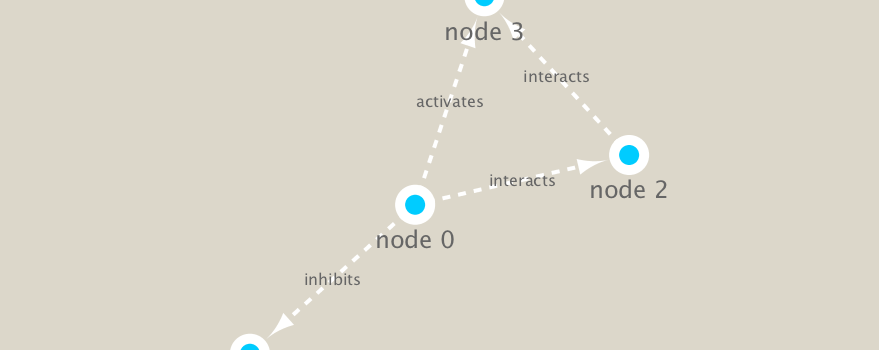

```{r setup, include=FALSE}
knitr::opts_chunk$set(echo = TRUE)
```

## Class 17

Is: list of files and Directories
PWD: print working directory (shows where you are in the file system)
CD: change directory
Root directory is a slash( / )
Home areas: users/shalakasiri/desktop or downloads or documents
Example to read a file: /users/barry/Downloads/data.csv

# Network reps

Width of edges=strength of relationship
Different representations: Heatmaps, networks, or list of relationships w/ optional weight

## Handout 2

```{r}
library(RCy3)

# Test the connection to Cytoscape.
cytoscapePing()
```

```{r}
# Check the version
cytoscapeVersionInfo()
```

```{r}
g <- makeSimpleIgraph()
createNetworkFromIgraph(g,"myGraph")

g
```

```{r}
plot(g)
```

```{r}
# this tells cytoscape to export the image

fig <- exportImage(filename="demo", type="png", height=350)


```


Change the cytoscape style
```{r}
setVisualStyle("Marquee")

```

```{r}
fig <- exportImage(filename="demo_marquee", type="png", height=350)


```


Metagenetics data

```{r}
library("igraph")
```

```{r}
## scripts for processing located in "inst/data-raw/"
prok_vir_cor <- read.delim("./data/virus_prok_cor_abundant.tsv", stringsAsFactors = FALSE)

## Have a peak at the first 6 rows
head(prok_vir_cor)
```

Now were going to send to Cytoscape, turning it from a dataframe into a network
```{r}
g <- graph.data.frame(prok_vir_cor, directed = FALSE)
class(g)
```

```{r}
plot(g)
```


This is a hot-mess! Lets turn off the blue text labels
```{r}
plot(g, vertex.label=NA)
```


The nodes/vertex are too big. Lets make them smaller...
```{r}
plot(g, vertex.size=2, vertex.label=NA)
```

```{r}
createNetworkFromIgraph(g, "myIGraph")
```

